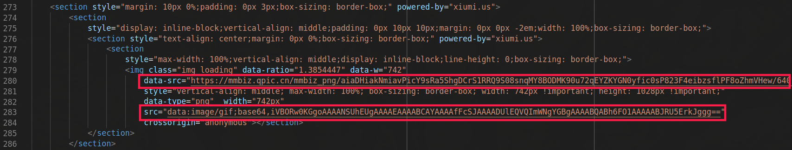

# wxcopyer

这是前几天我想要将俱乐部微信公众号上文章搬运到博客上时写的**一键替换图片地址**脚本.

💡 因为很有可能需要一些HTML的前置知识, 这个任务不算简单, 如果你想了解HTML, 我推荐[w3school](https://www.w3schools.com/html/default.asp). 当然也鼓励在群里讨论👍

## 脚本的目的

我当时遇到的问题是这样的:

我尝试了直接复制公众号文章全文, 利用typora能直接复制并转换HTML源码为markdown源码和自动保存图片到指定文件夹的特点将公众号的文字, 图片直接复制过来, 但这样丢失的样式实在太多, 各种为了装饰的图片和gif在markdown本身简洁朴素的渲染方式下显得很突兀. 因此我决定**直接将文章的HTML源码粘贴到markdown文件中, 尽可能保留样式**.

> gif展示的便是我如何将公众号文章**仅文章部分**的html源码复制下来的:
> - 首先翻一遍整篇文章, 让微信将所有图片加载出来. 倒不是说网页上有没有把图片加载出来和我要复制网页源代码有必然关系, 而是因为微信的图片采用了[惰性加载](https://www.cnblogs.com/moxiaowohuwei/p/7908877.html), 图片没加载时图片地址则是一张灰色的[加载图片](https://blog.csdn.net/JackieLiuLixi/article/details/36430379)
>
>   
>
>   💡 其实在图片没被加载前在`data-src`中也有我们需要的图片的地址, 此处只是因为我的脚本需要而已(我觉得这样写方便).
> - 然后按<kbd>F12</kbd>打开**开发者工具**, 找出文章的源代码, 复制下来
> - 最后复制到一个html文件中利用VSC右键菜单的**Format Document**一键格式化代码就OK了
>
> 

我尝试了一下发现对于我们的公众号来说这很简单, 样式也保留得很完整, 至少在我们的博客里显得和微信公账号的文章很像! 但紧接着我遇到了一个问题: **微信图片有毒**. 这里的有毒指两种情况, 一是一部分图片因为微信的防外链机制会显示为**此图片来自微信公众平台, 未经允许不可引用**, 另一种是当网页运行在一个服务器上时一些图片会因为不正确的跨域名访问被阻止.

> 用浏览器打开`./test/test.html`, 你就能看到一些写了**此图片来自微信公众平台, 未经允许不可引用**的图片, 不过你会看到后面的一些图片是没有问题的, 因为这个网页不是在一个服务器上.
>
> 💡 打开命令行, 进入`./test/test.html`所在文件夹, 输入下面这行代码可以在 http://localhost:8080 启动一个本地文件服务器, 打开这个网址你会发现这个网页显示了你在命令行输入这行命令时所在的文件夹.
> ```python
> python -m http.server 8080
> ```
> 这时在这个服务器中访问`./test/test.html`你会看到出现了一些显示崩溃图标的图.

第二个问题其实很好解决, 上网一搜我就找到了解决方法, 但第一个问题我尝试了网上提供的很多除了将图片下载到本地的办法也没能解决. 再一想到这两个问题的最简单的解决方式都是将链接发送给第三方网站, 第三方网站处理后我来调用, 会很大程度上依赖并不稳定的第三方平台 (比如那几个破解微信防外链的网站都崩了). 我决定还是把所有图片都下载到本地并替换文中图片地址.

因此我决定写一个脚本来做这件事!

## 要求

要求能把`./test/test.html`中的图片地址全部替换为本地地址, 图片下载到**html文件所在目录**下**文件同名文件夹**.示例输出可以看`./test_output`.

💡 你可以利用VSC的**文件比较功**能比较我提供的`test/test.html`好`test_output/test.html`的区别, 也可以利用VSC中集成的**git**来对比你对`test/test.html`处理前后的区别.